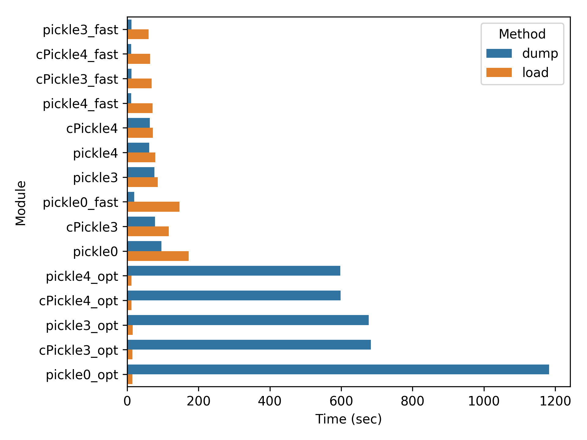
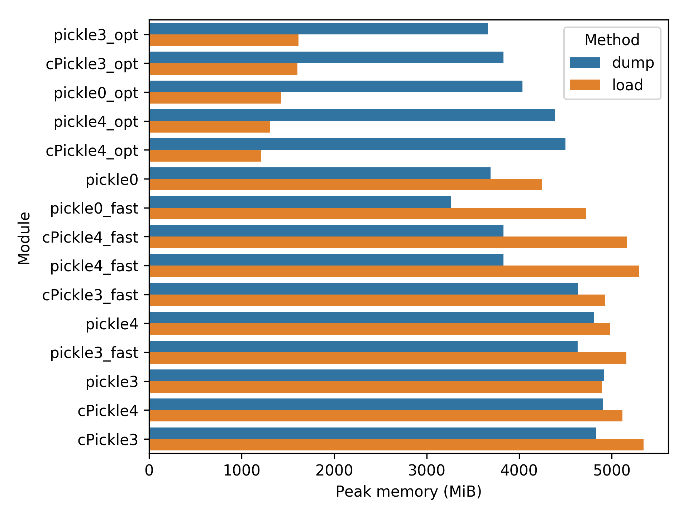
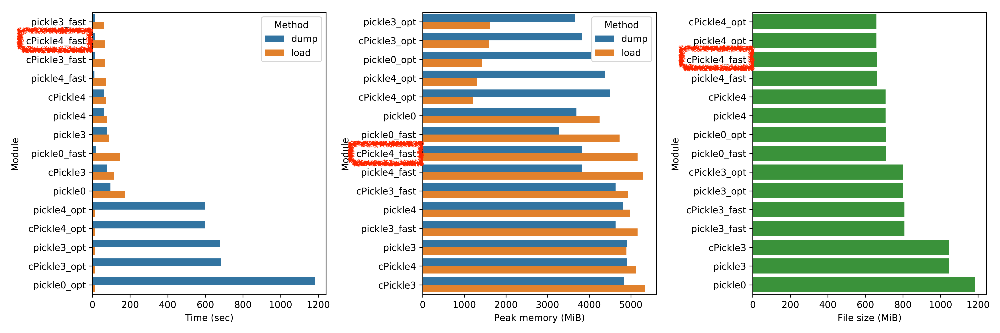
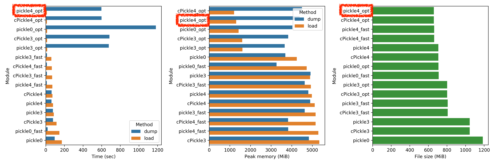

<!-- page_number: true -->

# 巨大なデータを保存・復元する
## 〜 なぜ、あなたのPickleは本気を出さないのか？〜

---

# 機械学習の結果など

```
[
    {'id1': ['data1': 0.65442,
             'data2': 1.32543,
             ...
            ]
    },
    {'id2': ['data1': -3.15776,
             'data2': 5.32543,
             ...
            ]
    },
    {'id3': ['data1': 6.23147,
             'data2': 0.44531,
             ...
            ]
    }, ...
]
```

---

# よくPickleで保存する

``` python
import pickle
with open("large_data.pkl", "wb") as f:
    pickle.dump(data, f)
```

---

# 巨大なPickleファイルを読み込むと...

``` python
import pickle
with open("large_data.pkl", "rb") as f:
    data = pickle.load(f)
```

---

# 遅すぎる！！

``` python
178.57 sec
```

---

# 他にも、

---

# 散々待たされて、メモリエラー

``` python
*** set a breakpoint in malloc_error_break to debug
python(3716,0xa08ed1d4) malloc: *** mach_vm_map(size=1048576) failed (error code=3)
*** error: can't allocate region securely
*** set a breakpoint in malloc_error_break to debug
Traceback (most recent call last):
  File "/System/Library/Frameworks/Python.framework/Versions/2.7/lib/python2.7/pickle.py", line 858, in load
    dispatch[key](self)
  File "/System/Library/Frameworks/Python.framework/Versions/2.7/lib/python2.7/pickle.py", line 1019, in load_empty_dictionary
    self.stack.append({})
MemoryError
```
---


---

# そもそもPickleってなに？

---

# Pickleとは
- オブジェクトをバイト列に変換する方法（Serialization）
	- 例：dict型の変数 -> バイナリファイル
	- 例：定義したクラスインスタンス -> バイナリファイル
- 直接ファイルを開いても読めない
- Pythonにしかない
- 機械学習モデルの保存によく使われる

---

# Pickleを早くする方法を調べました

---

# Pickleを早くする方法５つ
- `cPickle`モジュールを使う
- `protocol=4`を使う
- `fast=True`を使う
- `pickletools.optimize()`を使う
- generatorを使う

---

# １つ目：`cPickle`
- 標準のpickleをC言語で書き直したやつ
	- `pickle`: Pythonで書いてある
	- `cPickle`: C言語で書いてある
- 使い方

	``` python
    import pickle
    ```
    
    ↓
    
    ``` python
	import cPickle # Python2系
	import _pickle # Python3系
	```

---

# ２つ目：`protocol=4`
- pickleモジュールの最新プロトコルを使う
	- `protocol=0`: python2系のデフォルト
	- `protocol=3`: python3系のデフォルト、2系では使えない
	- `protocol=4`: 巨大オブジェクトをサポート
- 使い方

	``` python
    pickle.dump(x, f)
    ```
    
    ↓
    
    ``` python
	pickle.Pickler(f, protocol=4).dump(x)
	```

---

# ３つ目：`fast=True`
- 余分な PUT 命令コードを生成しなくなる
- [公式](https://docs.python.org/ja/3/library/pickle.html#pickle.Pickler.fast)によると廃止予定
- 使い方
  ``` python
  pickle.dump(data)
  ```

  ↓

  ``` python
  p = pickle.Pickler(f)
  p.fast = True # ここ
  p.dump(data)
  ```

---

# ４つ目：`pickletools.optimize()`
- 余分な PUT 命令コードを生成しなくなる（`fast=True`と同じ）
- 使い方

  ``` python
  pickle.dump(data)
  ```

  ↓

  ``` python
  import pickletools
  
  pickled = pickle.dumps(data)
  opt = pickletools.optimize(pickled)
  pickle.dump(opt, f)
  ```

---

# ５つ目：generator
- リスト全体を保持しない
- やり方

  ``` python
  def data_list():
      retunr [i for i in range(500000)]
  
  pickle.dump(data_list())
  ```

  ↓

  ``` python
  def data_generator():
      for i in range(500000):
          yield i
          
  for x in data_generator():
      pickle.dump(x, f)
  ```
---

# 比較してみた

---

# 比較するもの
- 時間
	- `dump`にかかる時間
	- `load`にかかる時間
- 最大メモリ使用量
	- `dump`に使うメモリ
	- `load`に使うメモリ
- `dump`されたファイルサイズ

---

# 使うデータ（リスト版）

大体１GBのデータ

``` python
[
    {
     'id': 1,
     'data': ['data11', 'data12', ..., 'data1100']
    },
    ...
    {
     'id': 500000,
     'data': ['data5000001', ..., 'data500000100']
    }
]
```

---

# 使うデータ（Generator版）

大体１GBのデータ

``` python
{
 'id': 1,
 'data': ['data11', 'data12', ..., 'data1100']
},
...
{
 'id': 500000,
 'data': ['data5000001', ..., 'data500000100']
}
```
---

# 環境

- Python 3.7.2
- MacBook Pro (2017)
  ```
  プロセッサ: 2.3 GHz Intel Core i5
  メモリ: 16 GB 2133 MHz LPDDR3
  ```

---

# 結果

---

# 時間（合計の小さい順）


---

# 最大メモリ使用量（合計の小さい順）


---

# ファイルサイズ（小さい順）


---

# 総合優勝

cPickle4_fast


---

# `load`最速賞（`dump`時間は無視）

pickle4_opt


---

# まとめ
- `load`と`dump`かなり早い、メモリふつう、ファイルほぼ最小
ただし廃止予定

  ``` python
  import _pickle as cPickle

  p = cPickle.Pickler(f, protocol=4)
  p.fast = True
  p.dump(data)
  ```

- `dump`激遅、`load`時に最速・メモリ最小、ファイル最小

  ``` python
  import pickle
  import pickletools

  p = pickle.Pickler(f, protocol=4)
  pickled = p.dumps(data)
  opt = pickletools.optimize(pickled)
  pickle.dump(opt, f)
  ```

---

# 次回

---

# 巨大なテキストデータを保存・復元する
## 〜最強のSerializationモジュール編〜

```
pickle
cPickle
json
csv
msgpack
hdfstore
marshal
dill
cloudpickle
hickle
...
```

